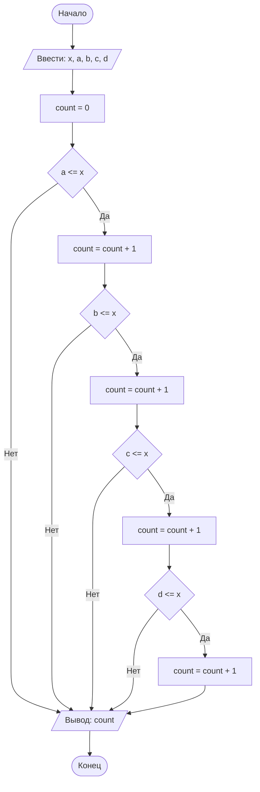

## Отчет по лабораторной работе №1

#### № группы: `ПМ-2601`

#### Выполнила: `Латыпова Айсылу Айратовна`

#### Вариант: `13`

### Cодержание:

- [Постановка задачи](#1-постановка-задачи)
- [Входные и выходные данные](#2-входные-и-выходные-данные)
- [Выбор структуры данных](#3-выбор-структуры-данных)
- [Алгоритм](#4-алгоритм)
- [Программа](#5-программа)
- [Анализ правильности решения](#6-анализ-правильности-решения)

  ### 1. Постановка задачи

> Набор бусинок диаметрами A, B, C, D, надетый на нить, пытаются протащить
> в указанном порядке через отверстие диаметром X. Какое количество
> бусинок удастся протащить через отверстие? На вход программы подаются
> натуральные числа X, A, B, C, D.

Данную задачу можно разделить на 2 подзадачи: сравнение диаметров бусинок A, B, C, D с диаметром отверстия X
и подсчёт количества бусинок, которые прошли через отверстие.


- Для 1 подзадачи нужно рассмотреть 8 случаев:
    1. `A <= X`
    2. `A > X` (отрицание 1 случая)
    3. `B <= X`
    4. `B > X` (отрицание 3 случая)
    5. `C <= X`
    6. `C > X` (отрицание 5 случая)
    7. `D <= X`
    8. `D > X` (отрицание 7 случая)

- Для 2 подзадачи нужно подсчитать количество бусинок, для которых условие <= X оказалось истинным до первой не
прошедшей бусинки. Если бусинка не проходит, все последующие за ней протащить нельзя, так как они находятся
за ней на нити.

Всего надо рассмотреть 2*2*2*2=16 случаев.

### 2. Входные и выходные данные

#### Данные на вход

На вход программа должна получать 5 натуральных чисел. В условии не сказано, к какому множеству принадлежат получаемые
числа, поэтому будем считать их натуральными (целыми положительными). Также даны нижние границы получаемых чисел.

|                       | Тип                | min значение    | max значение      |
|-----------------------|--------------------|-----------------|-------------------|
| X (диаметр отверстия) | Натуральное число  |        1        |  2<sup>31</sup> -1|
| A (Число 1)           | Натуральное число  |        1        |  2<sup>31</sup> -1|
| B (Число 2)           | Натуральное число  |        1        |  2<sup>31</sup> -1|
| C (Число 3)           | Натуральное число  |        1        |  2<sup>31</sup> -1|
| D (Число 4)           | Натуральное число  |        1        |  2<sup>31</sup> -1|

#### Данные на выход

Т.к. программа должна вывести количество бусинок, которые удалось протащить через отверстие,
то на выход мы получим единственное целое число неотрицательное число, не превышающее 4.

|             | Тип                | min значение    | max значение      |
|-------------|--------------------|-----------------|-------------------|
|   Число 1.  | Целое число        |        0        |         4         |

### 3. Выбор структуры данных

Программа получает 5 натуральных чисел. Поэтому для их хранения можно выделить 5 переменных 
(`x`, `a`, `b`, `c`, `d`) типа `int`.


|                       | название переменной | Тип (в Java) | 
|-----------------------|---------------------|--------------|
| X (диаметр отверстия) | `x`                 |    `int`     |
| A (бусинка 1)         | `a`                 |    `int`     | 
| B (бусинка 2)         | `b`                 |    `int`     |
| C (бусинка 3)         | `c`                 |    `int`     | 
| D (бусинка 4)         | `d`                 |    `int`     |

Для подсчёта количества прошедших бусинок заведём переменную `count` типа `int`.

### 4. Алгоритм

#### Алгоритм выполнения программы:

1. **Ввод данных:**  
   Программа считывает пять целых чисел, обозначенные как `x`, `a`, `b`, `c`, `d`.

2. **Инициализация счётчика:**
   Переменная `count` устанавливается в 0.

3. **Сравнение диаметров бусинок с диаметром отверстия:**

    - Проверяется первая бусинка `a`. Если `a` <= `x`, счётчик увеличивается на 1, иначе программа
      сразу переходит к выводу результата.
    - Проверяется вторая бусинка `b`. Если `b` <= `x`, счётчик увеличивается на 1, иначе программа
      сразу переходит к выводу результата.
    - Проверяется третья бусинка `c`. Если `c` <= `x`, счётчик увеличивается на 1, иначе программа
      сразу переходит к выводу результата.
    - Проверяется четвёртая бусинка `d`. Если `d` <= `x`, счётчик увеличивается на 1. После
      этого программа переходит к выводу результата.
4. **Вывод результата:**

На экран выводится значение `count` — количество бусинок, которые удалось 
протащить через отверстие.

#### Блок-схема



### 5. Программа

```java
import java.io.PrintStream;
import java.util.Scanner;

public class Main {
    // Объявляем объект класса Scanner для ввода данных
    public static Scanner in = new Scanner(System.in);
    // Объявляем объект класса PrintStream для вывода данных
    public static PrintStream out = System.out;

    public static void main(String[] args) {
        // Считывание пяти натуральных чисел из консоли
        int x = in.nextInt(); // диаметр отверстия
        int a = in.nextInt(); // диаметр 1-й бусинки
        int b = in.nextInt(); // диаметр 2-й бусинки
        int c = in.nextInt(); // диаметр 3-й бусинки
        int d = in.nextInt(); // диаметр 4-й бусинки

        // Счётчик прошедших бусинок
        int count = 0;

        // Проверяем бусинки по порядку.
        // Если очередная бусинка не проходит, дальше проверять нет смысла,
        // так как она загораживает путь остальным.
        if (a <= x) {
            count++;
            if (b <= x) {
                count++;
                if (c <= x) {
                    count++;
                    if (d <= x) {
                        count++;
                    }
                }
            }
        }

        // Вывод результата
        out.println(count);
    }
}
```

### 6. Анализ правильности решения

Программа работает корректно на всем множестве решений с учетом ограничений.

1. Тест на `A, B, C, D <= X` (все бусинки проходят):

    - **Input**:
        ```
        10 1 2 3 4
        ```

    - **Output**:
        ```
        4
        ```
2. Тест на `A > X` (первая бусинка не проходит):

    - **Input**:
        ```
        5 6 3 2 1
        ```

    - **Output**:
        ```
        0
        ```
3. Тест на `A <= X, B > X` (первая бусинка проходит):

    - **Input**:
        ```
        5 3 7 2 1
        ```

    - **Output**:
        ```
        1
        ```
4. Тест на `A, B <= X, C > X` (первая и вторая бусинки проходят):

    - **Input**: 
        ```
        6 3 4 8 2
        ```

    - **Output**:
        ```
        2
        ```
5. Тест на `A, B, C <= X, D > X` (первые три бусинки проходят):

    - **Input**:
        ```
        5 3 4 2 9
        ```

    - **Output**:
        ```
        3
        ```
6. Тест на равенство диаметра бусинки и отверстия `A, B, C, D = X`:

    - **Input**:
        ```
        5 5 5 5 5
        ```

    - **Output**:
        ```
        4
        ```
   
